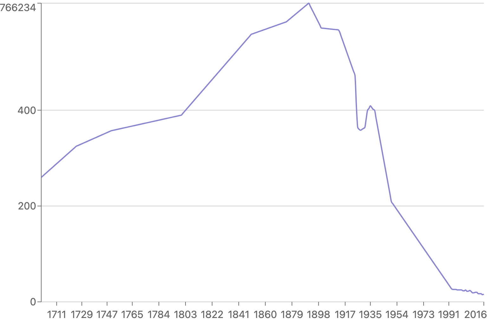
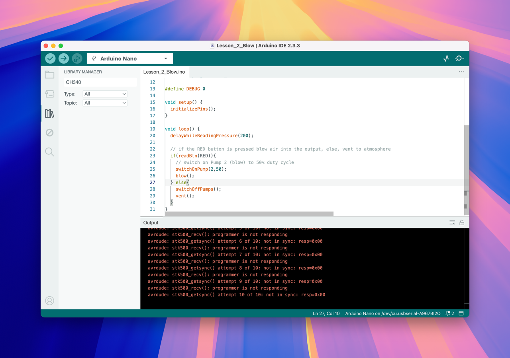

## Research

On the software side, my main two ideas right now are a real-time globe where you can click anywhere to "teleport" to the air quality there, or a narrative story like [I made on natural gas](https://flareup.vercel.app/) that looks at one place (London? NYC?) over time and draws connections to current NYC politics. I’ll get the basic interaction of a graph on a website & networking on the Arduino working this week, and decide the full scope later.

As of now, I’m planning to base the experience off [this article in _Our World in Data_](https://ourworldindata.org/london-air-pollution) since it features both data & narrative I can use as a starting place. I am planning to look into historical air quality data for NYC instead of London, but for now, the data is easy to work with.

## Plan

Last spring, taking Kate Hartman’s Haptics class, I [made a project](https://edu.lachlanjc.com/2024-03-04_hap_shareable_haptic_experience) that extended the Apple Vision Pro experience with finger haptics. In a tight two hours, the physical fabrication was not strong, but it made the point. I spent the majority of my time trying to set up the connection between the website and the Arduino, and settled on using [Liveblocks](https://liveblocks.io/) as a WebSockets server host with Wi-Fi on the Arduino.

This week, I wanted to get the basic networking stack set up for the project, for communication between the Arduino and the website,

## MVP of the website UI

First, I downloaded the _Our World in Data_ data as a CSV, cleaned it up in Numbers, then converted it to JSON. (`bunx csvtojson public/cities.csv > public/cities.json`)

Then, I duplicated my Vite/React/Liveblocks setup from the [haptics project repo](https://github.com/lachlanjc/web-haptics), and made a new Liveblocks room for this project. I installed [`recharts`](https://recharts.org/en-US/) for the graph, and made a basic graph of the data. Nothing special visually:



When hovering over the graph, I need to convert the percentage of the range to a number between 0-255, to send to the Arduino. ChatGPT suggested a quick function to do this, and I used React state to keep track of the current level highlighted.

Then, I layered in the Liveblocks SDK to send the current level to the Arduino, using the `useBroadcastEvent` hook. Here’s the full code:

```jsx
import React from "react";
import { RoomProvider, useBroadcastEvent } from "./liveblocks.config";
import { Line, LineChart, CartesianGrid, XAxis, YAxis } from "recharts";
import chartData from "../public/london.json";

const minSpm = chartData.map((d) => d.spm).reduce((a, b) => Math.min(a, b));
const maxSpm = chartData.map((d) => d.spm).reduce((a, b) => Math.max(a, b));

export default function LiveblocksProvider() {
  return (
    <RoomProvider id="air-quality" initialPresence={{}}>
      <App />
    </RoomProvider>
  );
}

const scaleToRange = (value, min, max, scaledMin, scaledMax) => {
  return Math.round(
    ((value - min) / (max - min)) * (scaledMax - scaledMin) + scaledMin,
  );
};

function App() {
  const broadcast = useBroadcastEvent();
  const [currentLevel, setCurrentLevel] = React.useState(0);

  const handleMouseMove = (state) => {
    if (state && state.activePayload && state.activePayload.length) {
      const currentValue = Number(state.activePayload[0].value);
      // map currentValue to 0-255
      const level = scaleToRange(currentValue, minSpm, maxSpm, 0, 255);
      setCurrentLevel(level);
      if (level !== currentLevel) {
        broadcast(level);
      }
    }
  };

  return (
    <LineChart
      width={768}
      height={512}
      data={chartData}
      onMouseMove={handleMouseMove}
    >
      <CartesianGrid horizontal={false} />
      <XAxis dataKey="year" axisLine={false} tickMargin={8} />
      <YAxis domain={[0, maxSpm]} />
      <Line
        type="monotone"
        dataKey="spm"
        stroke="#8884d8"
        dot={false}
        strokeWidth={2}
      />
    </LineChart>
  );
}
```

## Arduino

Forking my haptics project script, I got the basic setup of the Arduino connecting to Wi-Fi (the ITP Sandbox network) and listening for events from Liveblocks. Unfortunately, since I built that project, Liveblocks has changed their data format to transmit events as JSON instead of raw values when you broadcast events. I installed the Arduino JSON library, but the parsing doesn’t always seem to work, and the code is complex.

I was perusing old GitHub repos and found [sunscreenglow](https://github.com/lachlanjc/sunscreenglow), which used Adafruit IO, which I’d totally forgotten about, though it sent data from the Arduino then the website was read-only. That said, it might be easier to work with than Liveblocks, so I’ll try that next week.

## Hardware

I borrowed a Programmable Air pump from the ITP Shop, and followed [their code instructions](https://github.com/Programmable-Air/Code?tab=readme-ov-file), installing the Chinese manufacturer’s driver on my Mac and installing their Arduino library. I then uploaded their example code to the Arduino, but it didn’t work. I’ll need to troubleshoot this next week.



## Next week

3 main goals:

- Get the air pump working with the Arduino
- Switch the code to Adafruit IO
- Buy an inflatable pillow
