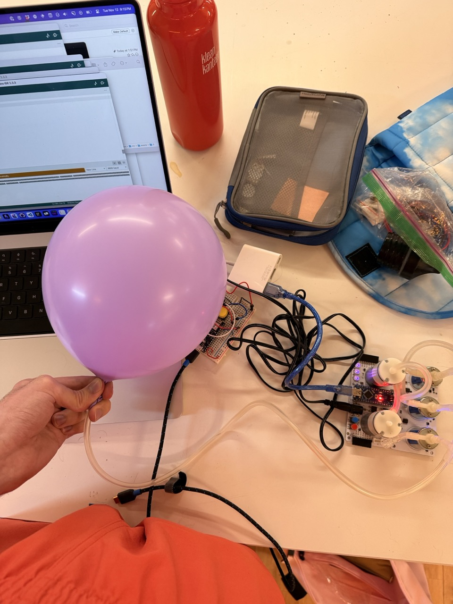
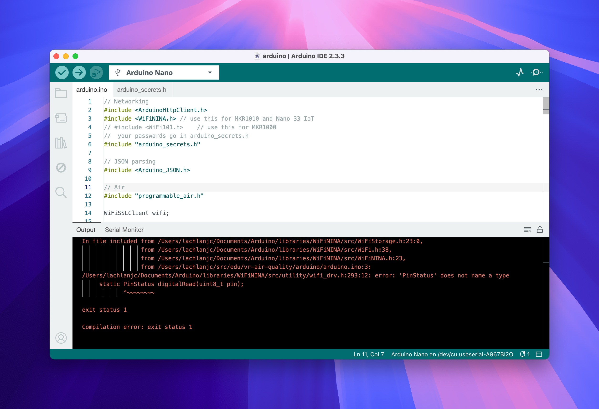
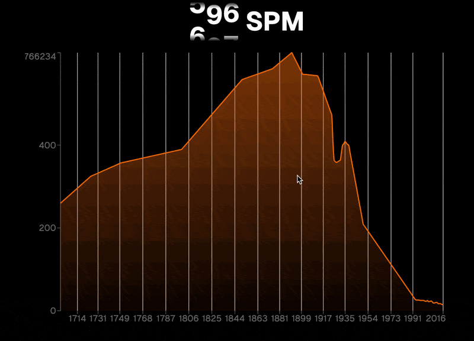

## Pillows

First, this week I explored Canal St luggage stores looking for inflatable neck pillows; none had any, nor did TJ Maxx. I instead ordered two from Amazon: [this wrap-around model](https://www.amazon.com/gp/product/B0CY1LLKYM?th=1), plus [this more conventional design](https://www.amazon.com/gp/product/B0C69RJVVT?th=1). They both look like terrible pillows, but will serve the purpose I need!

## Arduino

I also dug into Programmable Air more this week. Some of the ITP units are faulty, and unhelpfully two are labeled Kit 2, and the shop’s notes of which models work are out of date. That said, I got one unit working finally, inflating a balloon via its red button!



I then went to combine this firmware with last week’s Arduino program. No dice—this cryptic error revealed to me an architectural oversight, which is that the Arduino Nano board the Programmable Air unit runs on lacks Wi-Fi capabilities, so there’s no way to combine the two programs just yet:



I cannot use a wired connection to the computer if I want the project to be experienced in VR, so that will require hooking up my Arduino 33 Nano IoT to the Arduino Nano in the Programmable Air. I’m going to look into I2C for this.

I wanted to get further with the air pump, but none of the programs I run, including sample code, are able to output values back to my computer, which has totally blocked my progress. I need to calibrate the pressure sensor to the maximum and minimum inflated states of the pillow (or another balloon/bag while I wait for the Amazon deliveries), but without being able to get values off the Arduino I cannot make progress on that software. I’m going to discuss in class/with Ryan how to build out the I2C/serial communication.

### Arduino IO

One of my goals last week was to switch from my more complex Liveblocks setup to Arduino IO. I accomplished that without too much trouble, writing a quick `broadcast` function in JavaScript using Arduino IO’s HTTP API. I adapted the graph from last week to submit events via this funciton instead of Liveblocks.

```js
function broadcast(value) {
  return fetch(
    "https://io.adafruit.com/api/v2/lachlanjc/feeds/airquality/data",
    {
      method: "POST",
      headers: {
        "Content-Type": "application/json",
        "X-AIO-KEY": "KEY",
      },
      body: JSON.stringify({ value }),
    },
  )
    .then((res) => res.json())
    .catch((err) => {
      // console.error(err);
      throw new Error(err);
    });
}
```

## Software

I imported the custom font I want, Geist, set up some styling, then added a visible hover interaction, where hovering over the graph not only sends the events to Adafruit IO, but makes visible the level of particulate matter you’re currently experiencing.


