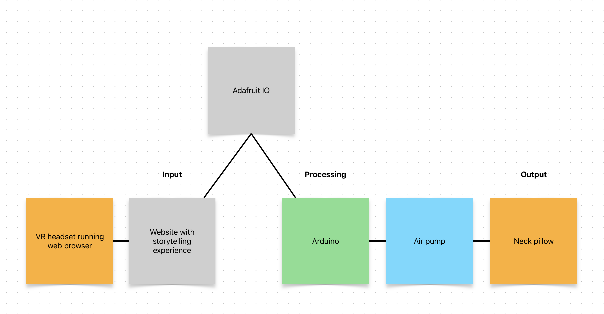

## System diagram

## Circuit diagram

TK

## Component datasheets

### Arduino

<object data="https://docs.arduino.cc/resources/datasheets/ABX00027-datasheet.pdf" width="100%" height="512"></object>

### Air pump

<object data="/datasheets/pump.pdf" width="100%" height="512"></object>

### Air valve

<object data="/datasheets/valve.pdf" width="100%" height="512"></object>

### Air valve transistor

<object data="/datasheets/TIP102.pdf" width="100%" height="512"></object>

### Voltage regulator

<object data="/datasheets/LM7805.pdf" width="100%" height="512"></object>

## Photos

TK
