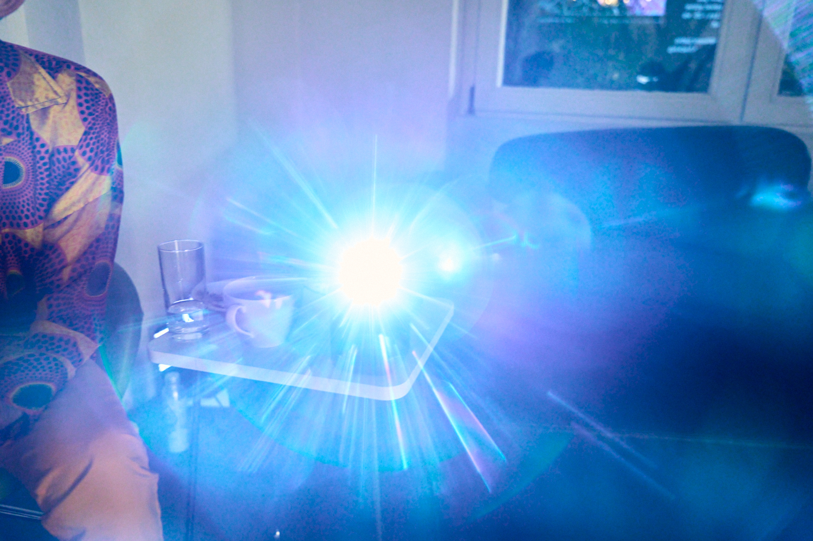

## Object

RAINS Bator jacket:

## Installation

NYU Berlin gallery opening Fingerfertigkeiten, December 2023:

## Data/storytelling

[_Our World in Data_: “What the history of London’s air pollution can tell us about the future of today’s growing megacities”](https://ourworldindata.org/london-air-pollution)

