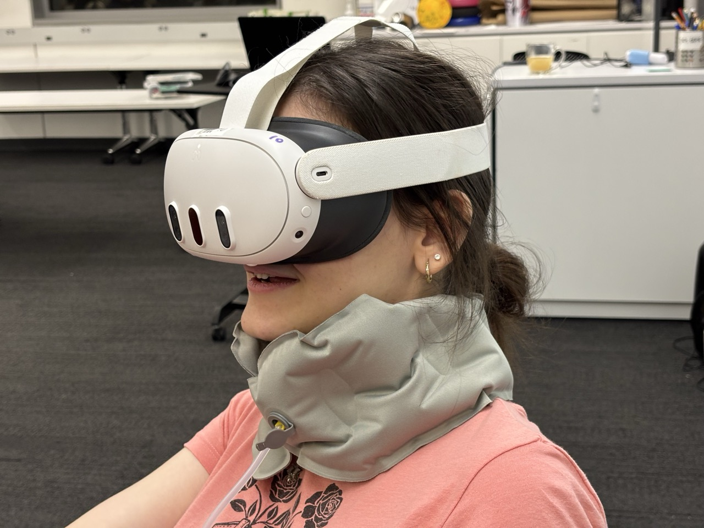
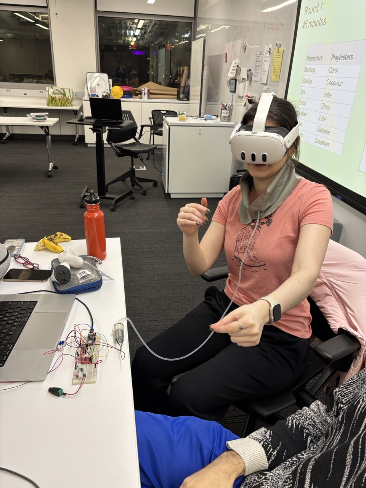
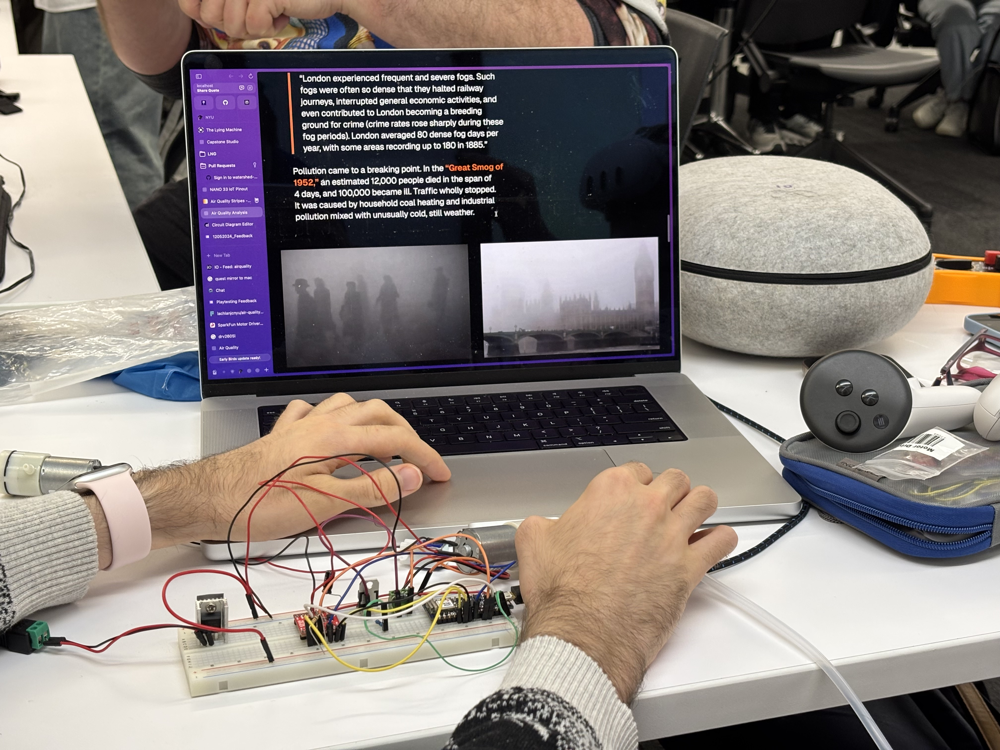

## Playtesting analysis

- What insights did you gain from this exercise?
  - VR is more confusing for other people who don’t use headsets often than I expected, even just putting it on & scrolling there is overwhelming.
- How did this shape your understanding of the project?
  - The project probably needs a passive experience for other viewers not wearing the headset/pillow
- What was surprising?
  - Right off the bat, I hadn’t considered the sizing of the neck pillow—Stefanie had it way looser than when I was wearing it
- What did you expect?
  - I expected people to be a little taken aback by the seriousness of it & to enjoy(?) learning about something very real
- How was this experience overall?
  - Super helpful to put the wearable on people & see their reactions!

### Stefanie

- Buttons should be more visually differentiated
- "I wish it choked me!"
- "It kept giving me anxiety I was going to die of air pollution"
- Make the collar smaller with more velcro
- Add haze/immersive environment
- "I like the VR but it could have the same effect on the computer"
  - Nvm, it's more claustrophobic in VR
- Inflation doesn't need to be automatic, it was fine with my
- Was not expecting the anxiety, even with the collar not fitting well

### Carol

- I liked the website design, liked the colors, vibe is there
  - Very polished, put togehter
- Like the motor noise
- Vocab being orange is confusing
- Coal graph is hard to read, make it bigger
- Looking back and forth with the left layout
- The buttons should be bigger & centered, the orange doesn't stand out. Make it more pressable, press to move on, shouldn't be skippable
- Did VR add to the experience? Passthrough sucks, want a haze, didn't feel immersive
- Pillow did add to the experience! Sensitive to touch, constant reminder
  - Deflation was harder to notice
- Story: could tell research was well-done, liked the map, connection to NYC, wants more connection to NYC

### Julie

- It was immersive, interesting experience
- Well thought-out project
- VR helped

### Zhou

- Disappointed that it's a VR device and this isn't very immersive
- Story: gesture for scrolling is tiring
- Inflation: offer some information on how the project works
