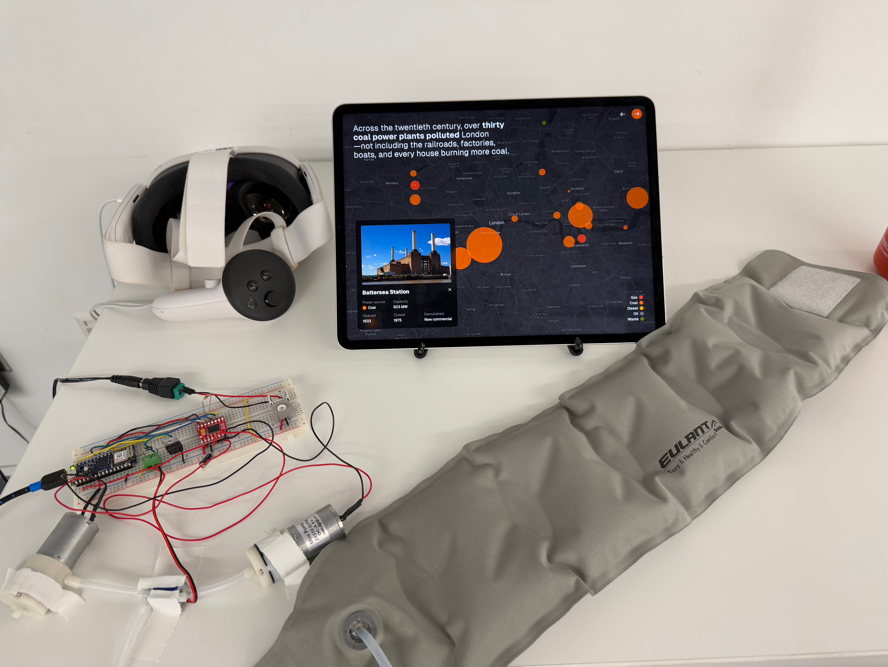

**London Smog** is a story about the history of air quality in London.
It has two parts: a website experience, ideally in VR, and a wearable pillow that inflates around your neck to simulate the air quality throughout the story in a physical way.

Presented at the [2024 ITP Winter Show](https://itp.nyu.edu/shows/winter2024/) in Downtown Brooklyn.

[**View website**](https://london-smog.vercel.app)

[Open source on GitHub](https://github.com/lachlanjc/london-smog)

<mux-player
playback-id="vE8WEUNDKz02SDv1LWIsg1Udi02d1h3SECZc02h9vMeBsE"
poster="https://image.mux.com/vE8WEUNDKz02SDv1LWIsg1Udi02d1h3SECZc02h9vMeBsE/thumbnail.jpg?width=1024&fit_mode=pad&time=0"></mux-player>

